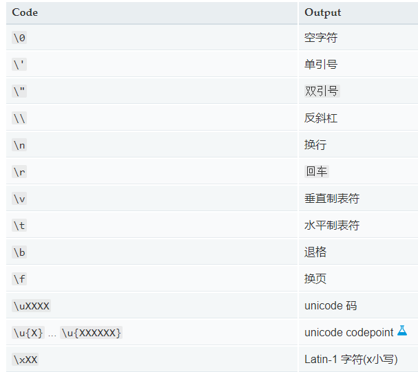
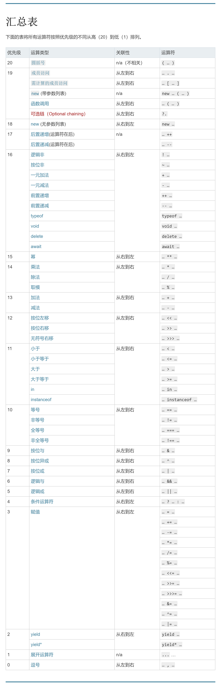

# JS 简介

## 什么是语言

- 计算机就是一个由人来控制的机器，人让它干嘛，它就就得干嘛。
- 我们要学习计的语言就是人和计算机交流的工具，人类通过语言来控制，操作计算机。
- 编程语言和我们说的中文、英文本质上没有区别，只是语法比较特殊
- 语言的发展：
  - 纸带机：机器语言
  - 汇编语言：符号语言
  - 现代语言：高级语言

## JavaScript 起源

- JavaScript 诞生于 1995 年，它的出现主要是用于处理网页中的前端验证。
- 所谓的前端验证，就是指检查用户输入的内容是否符号一定的规则、比如:用户名的长度，密码的长度，邮箱的格式等。

## JavaScript 特点

- 解释型语言
- 类似于 C 和 java 的语法结构
- 动态语言
- 基于原型的面向对象

# JS 基础

## js 引入

1. 外引

```html
<script src="URL"></script>
```

2. 内置

```htm
<script>
  // JS代码
</script>
```

1. 内嵌

```html
<button onclick="alert=('弹出块输出内容')"></button>
```

## js 注释

```JavaScript
//单行注释
```

```JavaScript
/*
多行注释
*/
```

## 基本输出语句

1. 浏览器弹出块

`alert('弹出块输出内容');`

2. 向 body 中输出内容

`document.write('页面输出内容');`

3. 向控制台输出内容

`console.log('控制台输出内容');`

## 基本语法

1. JS 中严格区分大小写。
2. JS 中每一条语句以英文分号(;)结尾。
3. JS 中会忽略多个空格和换行。

## 字面量和变量

字面量(常量)：都是不可改变的值，都是可以直接使用的，但是我们一般都不会直接使用

变量：可以保存字面量，而且变量的值是可以任意改变的，变量更加方便我们使用，所有在开发中都是通过变量去保存一个字面量，也可以用变量对字面量进行描述。

声明变量：

使用 var 关键字声明一个变量

```JavaScript

var a = 123;

```

## 标识符

- 在 js 中所有的可以由我们自主明明的都可以称为标识符,例如：变量名、函数名、属性名
- 命名标识符是需要遵守
  1. 标识符中可以含有 字母 数字 \\\\\\\\\\\\\\\\\\\\\\\\\\\\\\\\\\\\\\\\\\\\\\\\\\\\\\\\\\\\\\\\\\\\\\\\\\\\\\\\\\\\\\\\\\\\\\\\\\\\\_ \$
  2. 标识符不能以数字开头
  3. 标识符不能是 ES 中的[关键字或者保留字](https://developer.mozilla.org/zh-CN/docs/Web/JavaScript/Reference/Reserved_Words)
  4. 标识符一般都使用驼峰命名法(首字母小写，每个单词开头字母大小，其余字母小写)

## 数据类型

数据类型指的是字面量的类型，在 JS 中一共有 6 中数据类型：

1. String 字符串
2. Number 数值
3. Boolean 布尔值
4. Null 空值
5. Undefined 未定义
6. Object 对象

其中 String、Number、Boolean、Null、Undefined 属于基本数据类型，而 Object 属于引用类型

### 1.String 字符串

- 字符串声明时把字面量加引号即可
- 单引号和双引号都可以
- 引号不能嵌套，双引号不能放双引号，单引号不能放单引号
- 在字符串中我们可以使用/作为转义字符，当表示一些特殊符号时可以进行转义
  

```JavaScript
var str = "hello"
```

### 2.Number 数值

- 所有数值都是 Number(正数、浮点数)
- Number.MAX_VALUE 是 js 中的最大值
- Number.MIN_VALUE 是 js 中的最小值(大于 0 的最小值)
- Infinity 表示正无穷
- -Infinity 表示负无穷
- NAN 是一个特殊的数字，表示 Not a Number
- 如果使用 JS 进行浮点数运算，可能得到一个不精确的结果

### 3.Boolean 布尔值

布尔值只有两个

- true 表示真
- false 表示假

### 4.Null

Null 的类型的值只有一个 null
null 这个值专门用来表示为空的对象
同 typeof 检查 null 会返回 object

### 5.Undefined

Undefined 的类型的值只有一个 Undefined
当声明一个变量，不给其赋值时就表示 Undefined

## 强制类型转换

- 指将一个数据类型转换为其他数据类型
  - 将其他的数据类型转换为 String、Number、Boolean

1. 转 String

   1. 调用 toString()方法
      - Null 和 Undefined 没有 toString()方法
   2. 调用 String()函数
      - Null 和 Undefined 有 String()函数

2. 转 Number

   1. 调用 Number()函数

      > 字符串不是纯数字时将会转换成 NaN

      > 空串和空格字符串都转换为 0

      > Boolean 转 Number true 为 1 false 为 0

      > Null 转 Number 为 0

      > Underfined 转 Number 为 NaN

   2. 调用 parseInt()函数

      > 将字符串中有效的正数提取出

   3. 调用 parseFloat()函数

      > 将字符串中有效的浮点数提取出

   4. 进制转换
      在 JS 中，

      - 表示 16 进制的数字，则需要 0x 开头
      - 表示 8 进制的数字，则需要 0 开头
      - 表示 2 进制的数字，则需要 0b 开头，不是所有浏览器都支持
      - 可以在 parseInt()中传第二个参数

      ```js
      parseInt("070", 10);
      ```

3. 转 Boolean
   1. 调用 Boolean()函数
      - Number 转 Boolean 除了 0 和 NaN 是 false 其余的都是 true
      - String 转 Boolean 除了空串是 false，其余的都是 true
      - Null 和 Undefined 都会转换为 false
      - Object 会转换为 true

## 运算符

运算符也叫操作符
通过运算符可以对一个或多个值进行运算,并获取运算结果

### 算数运算符

加减乘除，不会更改原变量，只计算结果

#### +

当对非 Number 类型的值进行计算时，会隐形转换成 Number 进行计算

任何值与 NaN 进行计算都是 NaN

当两个字符串进行加法运算，会做拼串操作

任何的值和字符串做加法运算，都会先转换成字符串，然后再和字符串做拼串的操作

#### -

对两个值进行减法运算

#### \*

对两个值进行乘法运算

#### /

对两个值惊喜除法运算

#### %

对两个值进行取模运算(余数)

### 一元运算符

#### +

正号
正号不会对 Number 产生影响
对非 Number 的数据转换成 Number

#### -

负号
负号可以对 Number 进行符号的取反
对非 Number 的数据转换成 Number，然后符号取反

### 自增 自减

#### 自增 a++

通过自增可以使变量在自身的基础上加 1
对于一个变量自增以后，原变量会立即自增 1

#### 自减 a--

通过自减可以使变量在自身的基础上减 1
对于一个变量自减以后，原变量会立即自减 1

自增自减符号在前和在后有区别，
当打印 a++是原变量的值
打印++啊是新值

例如:

- 自增
  - 自增符在后：
  ```js
  var a = 10;
  console.log(a++); //10
  console.log(a); //11
  ```
  - 自增符在前：
  ```js
  var a = 10;
  console.log(++a); //11
  console.log(a); //11
  ```
- 自减
  - 自减符在后：
  ```js
  var a = 10;
  console.log(a--); //10
  console.log(a); //9
  ```
  - 自减符在前：
  ```js
  var a = 10;
  console.log(--a); //9
  console.log(a); //9
  ```

### 逻辑运算符

JS 中为我们提供了三种逻辑运算符

```js
!   //非
&&  //与
||  //或
```

#### 非!

对 Boolean 进行取反，
如果对一个值两次取反，他不会变化

如果对非 Boolean 类型进行取反，它会先转换为 Boolean 然后进行取反

为任意的数据类型做两次非运算，即可将其转换为布尔值

#### 与&&

可以对符号两次的值进行与运算并返回规则

两边只要 有一个 false，就会返回 false

如果第一个值为 false，则不会检查第二个值

#### 或||

可以对符号两次的值进行与运算并返回规则

只要有一个 true，就会返回 true

如果第一个值为 true，则不会检查第二个值

#### 非 Boolean 值的运算

对于非 Boolean 值惊喜运算时

会先将其转换为 Boolean，然后在运算，并且返回原值

`&&`

如果两个值都为 true，则返回后面的。

如果两个值为 false，则返回靠前的

`||`

如果两个值为 true，则返回靠前的

如果两个值都为 false，则返回后面的。

### 赋值运算符

#### =

可以将符号右侧的值赋给左侧的变量

#### += -= \*= /= %=

`a += 5;` 等价于 `a = a + 5;`

`a -= 5;` 等价于 `a = a - 5;`

`a *= 5;` 等价于 `a = a * 5;`

`a /= 5;` 等价于 `a = a / 5;`

`a %= 5;` 等价于 `a = a % 5;`

### 关系运算符

通过关系运算符可以比较两个值直接的大小关系
如果关系成立，它会返回 true，如果不成立则返回 false

#### >

判断符号左侧的值是否大于右侧，

#### >=

判断符号左侧的值是否大于或等于右侧

#### <

判断符号左侧的值是否小于右侧，

#### <=

判断符号左侧的值是否小于或等于右侧

#### 对于非 Number 的值比较

对于非 Number 的值会先转换成 Number 再比较

任何值和 NaN 做任何比较都是 false

如果符号两侧都是 String 不会将其转换为 Number，而是比较他们的 Unicode 编码，
如果两值第一位一样，则比较第二位

### 相等运算符

比较两个值是否相等
如果相等返回 true，否则返回 false

#### ==

用`==`来做相等运算
当用`==`来比较两个值时，如果值的类型不同，则会自动惊喜类型转换，将其转换为相同的类型然后在比较

- Undefined == Null
- NaN 不和任何值相等，包括他本身
  - 可以通过 isNaN()函数来判断一个值是否是 NaN(如果该值是 NaN 返回 true，否则返回 false)

#### !==

用`!==`来做不相等运算
当用`!==`来比较两个值时,如果不相等返回 true，否则返回 false，不相等也会对变量惊喜自动的类型转换，如果转换后相等它也会返回 false

#### ===

用`===`来做全相等运算
当用`===`来比较两个值时，不会进行类型转换，如果两个值的类型不相同，会直接返回 false

#### !===

用`!===`来做不全相等运算
当用`!===`来比较两个值时，不会进行类型转换，如果两个值的类型不相同，会直接返回 true

### 条件运算符

条件运算符也叫三元运算符
语法：

- 条件表达式?:语句 1:语句 2；

执行流程

- 条件运算符在执行时，首先对条件表达式进行求职，
  - 如果该值为 true，则执行语句 1，并返回执行结果
  - 如果该值返回 false，则执行语句 2，并返回结果
- 如果条件表达式的结果非 Boolean 值，会自动转换为 Boolean

### 运算符的优先级



## 代码块

程序是由一条一条语句构成的

语句是按照自上向下的顺序执行的

在 JS 中可以使用`{}`来为语句分组

同一个`{}`中的语句我们称为一组语句，

它们要么都执行，要么都不执行

一个`{}`中的语句我们也称为一个代码块

在代码块后面不用写`;`了

JS 中的代码块，值具有分组的作用，没有其他用途代码块中的内容，在外部完全可见的。

## 流程控制语句

JS 中的语句是一行一行执行的

通过流程控制语句可以控制程序执行流程
使程序可以更加一定的条件来执行

- 语句的分类
  1. 条件判断语句
  2. 条件分支语句
  3. 循环语句

### 条件判断语句(if 语句)

使用条件判断语句可以在执行某个代码之前进行判断

如果条件成立才会执行语句，条件不成立则语句不执行。

- 语法一

  ```js
  if(条件表达式){
    语句...;
    }
  ```

  if 语句在执行时，会先对条件表达式进行求职判断，

  如果条件表达式的值为 true，则执行 if 后的语句

  如果条件表达式的值为 false，则不会执行 if 后的语句

- 语法二

  ```js
  if(条件表达式){
    语句...;
    }else{
      语句...;
    }
  ```

  当该语句执行时，会先对 if 后的条件表达式进行求值判断，

  如果该值为 true，会执行 if 后的语句，并不会执行 else 后的语句

  如果该值为 false，跳过 if 后的语句，执行 else 后的语句

- 语法三

  ```js
  if(条件表达式){
    语句...;
    }else if(条件表达式){
      语句...;
    }else if(条件表达式){
      语句...;
    }else{
      语句...;
    }
  ```

  当该语句执行时，会从上到下依次对条件表达式惊喜求值判断

  如果值为 true，则执行当前语句

  如果值为 false，则依次向下判断

  如果所有条件都不满足，则会执行最后的 else 语句

  一但满足一个条件，剩下的都不会执行

### 条件分支语句(switch 语句)

- 语法

```js
switch(条件表达式){
    case 表达式1:
      语句...
      break；
    case 表达式2:
      语句...
      break；
    case 表达式3:
      语句...
      break；
    default:
      语句...
}
```

执行流程：

switch...case...语句

在执行时会依次将 case 后的表达式的值和 switch 后的条件表达式的值进行全等比较

如果比较结果为 true，则从当前 case 处开始执行代码。遇到 break 处跳出 switch 语
句

如果比较结果为 false，则继续向下比较

如果所有比较结果都为 false，则执行 default 后面的语句

### 循环语句

循环语句：

通过循环语句可以反复的执行一段代码多次

#### while 循环

- 语法：

  ```js
  while(条件表达式){
    语句...
  }
  ```

  1. 先对条件表达式进行求值判断

  2. 如果为 true 则继续执行循环体

  3. 循环体执行完毕一行，继续对表达式惊喜判断

  4. 如果还为 true，则继续执行循环体，依次类推

  5. 如果值为 false，则终止循环。

创建一个循环，往往需要三个步骤

1. 初始化一个变量`var i = 0;`

2. 在循环中设置一个条件表达式 `while(i<10){ }`

3. 定义一个更新更新表达式。每次更新初始值变量`i++;`

#### do...while 循环

- 语法：

```js
do{
  语句...
}while{
  条件表达式
}
```

- 执行流程

  1. do...while 语句在执行时，会先执行循环体，

  2. 循环体执行完毕后，在对 while 后的条件表达式惊喜判断，

  3. 如果结果为 true，则继续执行循环体，执行完毕继续判断以此类推

  4. 如果结果为 false，则终止循环

  5. do...while 可以保证循环体至少执行一次

#### for 循环

在 for 循环中，为我们提供了专门的位置，来写初始化表达式、条件表达式、更新表达式

- 语法：

  ```js
  for(初始化表达式;条件表达式;更新表达式){
    语句...
  }
  ```

- 执行流程

  1. 执行初始化表达式，初始化变量

  2. 执行条件表达式来判断是否执行循环。

  3. 如果为 true，则执行循环

  4. 如果为 false，则终止循环

  5. 执行更新表达式，更新表达式执行完毕基线重复执行 (2)

for 循环中的三个部分都可以省略，也可以写在外部

### break 和 continue

- break
  break 关键字可以用来退出 switch 或循环语句
  不能在单独的 if 语句里使用
  break 关键字会立即终止离他最近的循环语句
  可以为循环语句创建一个 label，来标识当前的循环,然后通过 break 终止指定的循环
  ```js
  out:
  for(){}
  break out;
  ```
- continue

  continue 关键字可以跳过当次循环
  不能在单独的 if 语句里使用
  continue 同样的只会对他最近的循环起作用
  可以为循环语句创建一个 label，来标识当前的循环,然后通过 continue 终止指定的一次循环

可以使用 break 和 continue 进行对性能的优化

## 对象

- Object 对象

对象属于一种复合的数据类型，在对象中可以保存多个不同数据类型的属性

- 对象分类
  1. 内建对象
     - 由 ES 标准中定义的对象，任何 ES 的实现中都可以使用
     - 例如：String Number ......
  2. 宿主对象
     - 由 JS 的运行环境提供的对象，目前来讲主要指由浏览器提供的对象
     - 例如：BOM DOM
  3. 自定义对象
     - 由开发人员自己创建的对象

### 基本操作

- 创建对象

```js
// 用new关键字调用的函数，是构造函数construction
// 构造函数是用来专门创建对象的函数
var obj = new Object();
```

- 添加属性
  在对象中保存的值称为属性
  - 语法：
    对象.属性名=属性值;

```js
obj.age = 18;
```

- 读取属性
  - 语法:
    对象.属性名
    如果读取对象中没有的属性，不会报错，而是返回 undefined

```js
console.log(obj.age);
```

- 修改属性
  - 语法:
    对象.属性名=新值

```js
obj.age = 20;
```

- 删除属性
  - 语法:
    delete 对象.属性名

```js
delete boj.age;
```

### 属性名

- 对象的属性名不强制要求遵守标识符的规范
- 什么乱七八糟的名字都可以
- 但是我们尽量按照标识符的规范去做
  如果要使用特殊的属性名，不能采用.的方式来操作
  需要使用另一种方式，

- 语法：

```js
对象["属性名"] = 属性值;
```

- 使用[]这种形式去炒作属性，更加灵活，
- 在[]中可以直接传递一个变量，这样变量的值是多少就会读取哪个属性

### 属性值

JS 对象的属性值，可以是任意的数据类型，甚至也可以是一个对象

### in

- 通过该运算符可以检查一个对象中是否含有指定的属性
- 如果有则返回 false，没有则返回 false

- 语法：
  ```js
  "属性名" in 对象;
  ```

### 基本数据类型和引用数据类型

基本数据类型：

- String
- Number
- Boolean
- Null
- Undefined

引用数据类型：

- Object

JS 中的变量都是保存到栈内存中的

- 基本数据类型的值直接在栈内存中存储
- 值与值直接是独立存在的，修改一个变量不会影响其他的变量

- 引用数据类型的值是保存到堆内存中的，每创建一个新的对象，就会在堆内存中开辟一个新的空间，
- 而变量保存的对象的内存地址，(对象的引用)，如果两个变量，保存的是同一个对象引用，当通过一个通过变量修改属性时，另一个也会修改

- 当比较两个基本数据类型的值是，就是比较值
- 而比较两个引用数据类型的值是，是比较内存地址

### 对象字面量

使用对象字面量来创建一个对象

```js
var obj = {};
```

使用对象字面量，可以在创建对象时，直接指定对象中的属性，
- 语法
    ```js
    var obj = {
      属性名:属性值,
      属性名:属性值...
    }
    ```
对象字面量的属性名，可以加引号，也可以不加，建议不加，
如果要使用一些特殊的名字，则必须要加引号

属性名和属性值是一组一组的名值对结构
名和值直接使用:链接，多个名值直接使用,隔开
如果一个属性之后没有其他的属性了，就不用写。